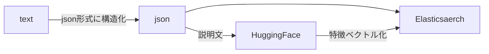
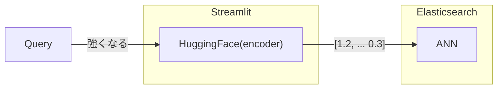

# Doraemon Himitsu Dogu Japanese semantic search

Python based Doraemon Himitsu Dogu Japanese semantic search based on Elasticsearch approximate nearest neighbor(ANN) feature.

Japanese: Elasticsearch の近似近傍探索機能を使ったドラえもんのひみつ道具自然言語検索エンジン


## Key technology

- HuggingFace
  - [sonoisa/sentence-bert-base-ja-mean-tokens-v2](https://huggingface.co/sonoisa/sentence-bert-base-ja-mean-tokens-v2)
- Elasticsearch
- Streamlit

## Dataset

I made a Himitdu Dogu dataset based on this site.
[ひみつ道具カタログ](https://www.tv-asahi.co.jp/doraemon/tool/a.html)

## Indexing phase



## Search phase



## How to set up

```bash
# Do in background...
$ make run-es
make run-es
es01
[+] Building 0.1s (6/6) FINISHED
 => [internal] load build definition from Dockerfile                                                                                                                           0.0s
 => => transferring dockerfile: 223B
...

$ make build-index
Get the certification for ElasticSearch
Make structured data from raw data
poetry run python doraemon_himitsu_dogu_search/preprocess.py
Run sentens vectorizer
poetry run python doraemon_himitsu_dogu_search/sentents_bert_vectorizer.py
Start BERT encode
100%|█████████████████████████████████████████████████████████████████████████████████████████████████████████████████████████████| 41/41 [03:02<00:00,  4.45s/it]
End BERT encode
Start serialization as numpy file
End serialization
Run Elasticsearch indexing job
poetry run python doraemon_himitsu_dogu_search/indexer.py

$ make run-app
Get the certification for ElasticSearch
Running the web app for Doraemon himitsu dogu search
poetry run streamlit run doraemon_himitsu_dogu_search/app.py

  You can now view your Streamlit app in your browser.

  Local URL: http://localhost:8501
```


## Related Posts

- [Elasticsearchの近似近傍探索を使って、ドラえもんのひみつ道具検索エンジンを作ってみた \| 🦅 hurutoriya](https://shunyaueta.com/posts/2022-10-23-2344/) in Japanese
