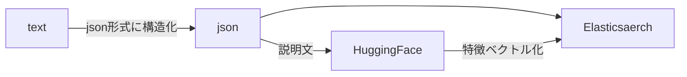
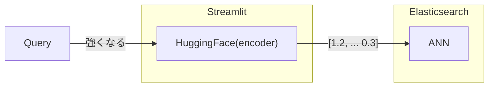

# Doraemon Himitsu Dogu Natural Language Search

Python based Doraemon Himitsu Dogu Natural Language Search based on Elasticsearch approximate nearest neighbor(ANN) feature.

Japanese: Elasticsearch の近似近傍探索機能を使ったドラえもんのひみつ道具自然言語検索エンジン

## Key technology

- HuggingFace
  - [sonoisa/sentence-bert-base-ja-mean-tokens-v2](https://huggingface.co/sonoisa/sentence-bert-base-ja-mean-tokens-v2)
- Elasticsearch
- Streamlit

## Dataset

I made a Himitdu Dogu dataset based on this site.
[ひみつ道具カタログ](https://www.tv-asahi.co.jp/doraemon/tool/a.html)

## Indexing phase

## Search phase

